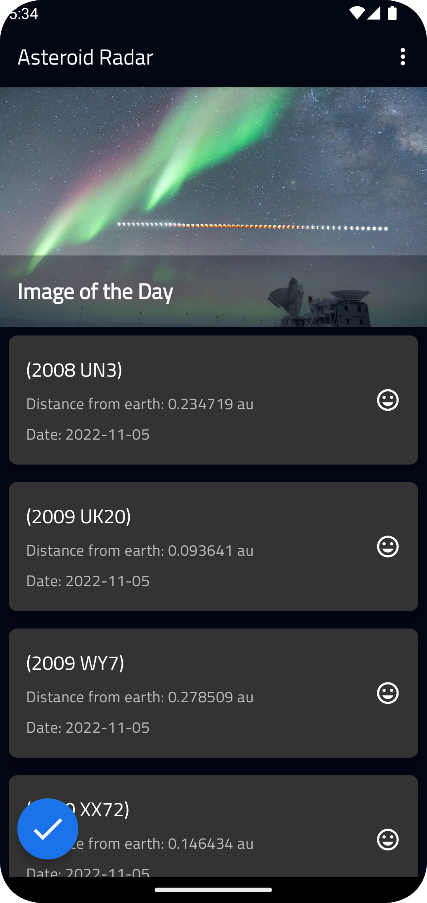
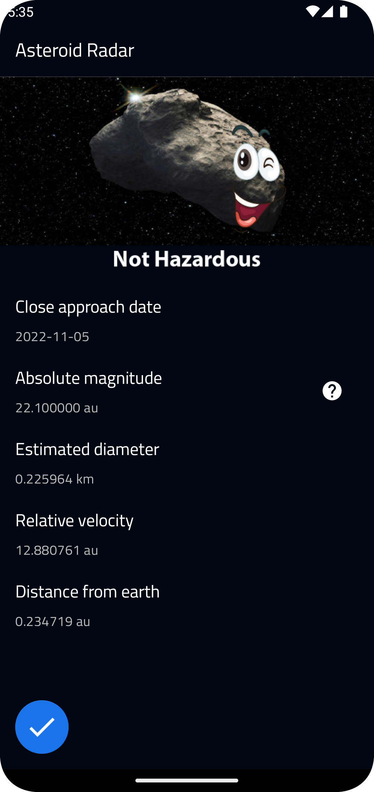
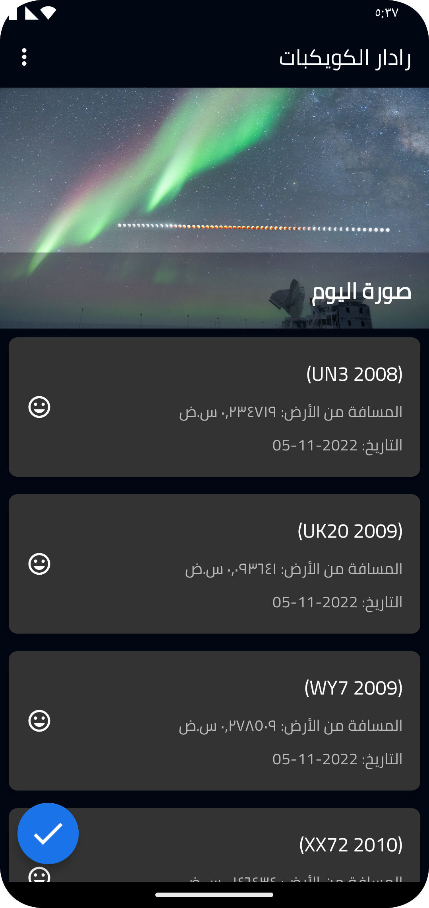
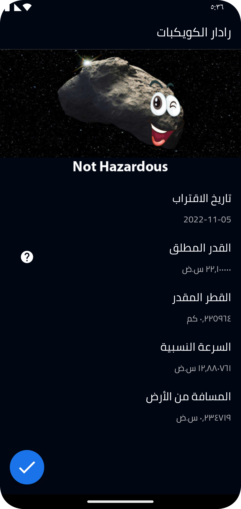

# NASA-Asteroids
### With NASA-Asteroids a user can: search for Asteroids based on their closest approach date to Earth, lookup a specific Asteroid with its NASA JPL small body id, as well as browse the overall data-set using [Asteroids - NeoWs API](https://api.nasa.gov/)

* Recycler View
* MVVM
* DataBinding
* ViewModel & LiveData
* Retrofit & Moshi
* Coroutines
* Room database
* work-manager 
* accessibility & multiple languages 

  
  

  
  

## Getting Started

This project is a starting point for a Android application Development.

A few resources to get you started:

- [Android Documentation](https://developer.android.com/docs)
- [Android Jetpack](https://developer.android.com/jetpack?gclid=CjwKCAjwtKmaBhBMEiwAyINuwLwczCSIvTy5CHI8ISBbH0yS5nYBO1lGKSBI6Vh9Os4B4M0OAUyiaRoCIYwQAvD_BwE&gclsrc=aw.ds)

